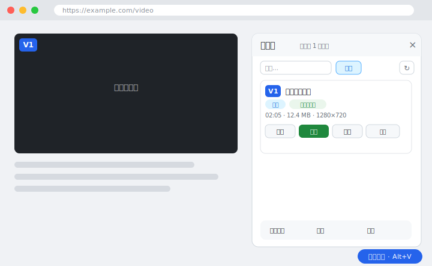
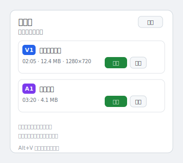
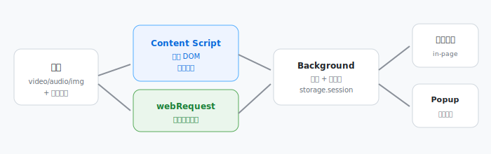

# 抓媒酱

[](https://github.com/Nhj-sz/media-catcher-extension/actions/workflows/test.yml)
[](LICENSE)

一个自研的 Chrome / Edge 扩展，用来嗅探网页里的视频 / 音频 / 图片直链，并在页面内提供悬浮面板做定位、下载、录制与批量导出——不用再在 F12 里逐个点 “Open in new tab”。

**English:** A Chrome/Edge extension that captures direct links of videos, audios and images from web pages, and offers an in-page panel for locating, downloading, recording and bulk export.

## 目录

- [功能特性](#功能特性)
- [界面预览](#界面预览)
- [安装](#安装)
- [使用](#使用)
- [工作原理](#工作原理)
- [权限与隐私](#权限与隐私)
- [开发 / 测试](#开发--测试)
- [常见问题与限制](#常见问题与限制)
- [许可证](#许可证)
- [免责声明](#免责声明)

## 功能特性

- **多类型捕获**：视频、音频、图片直链一网打尽。
- **双路来源合并**：后台实时捕获媒体网络请求 + 内容脚本扫描页面 DOM，合并展示并标注来源（页面元素 / 网络捕获）。
- **精准定位**：给页面每个视频 / 图片打上可点击编号角标（`V1` / `I1` / `A1`），一键高亮对应元素（约 2 秒后自动消散）。
- **一键下载 / 复制 / 打开**：直接走浏览器下载管理器，或复制链接、在新标签打开。
- **录制下载**：没有可下载直链时，直接录制正在播放的视频 / 音频并保存为本地文件（录制产物优先为 MP4：视频 `.mp4`、音频 `.m4a` / `.mp3`）。
- **音频文件名智能识别**：下载 / 录制默认使用 `.mp3` / `.m4a` / `.webm` 等音频扩展名，不再误标为 `.mp4`。
- **流媒体识别**：对 `m3u8` / `mpd` 等分片流标注「流媒体」并禁用直链下载，避免误下清单文件。
- **iframe 捕获**：支持捕获 iframe 内嵌页面中的视频 / 音频（子框架媒体也可识别与下载）。
- **筛选与批量**：搜索、类型过滤（全部 / 仅视频 / 仅图片）、仅播放中过滤，当前筛选结果批量下载，并支持导出 TXT / CSV / JSON。
- **数据持久化**：后台 Service Worker 被浏览器回收后，已捕获的媒体记录不会丢失（会话级 `storage.session`）。
- **B 站视频直链下载**：在 B 站播放页（含网页内悬浮面板与工具栏弹窗），可一键「解析可下载清晰度」并直接下载。解析时优先请求 DASH 以列出所有可用清晰度；点击下载时优先尝试该清晰度的**音视频合一 MP4 直链**，拿不到再下载 DASH 视频+音频两个文件并附 ffmpeg 合并命令。（原理：从 URL 读取 `bvid` → WBI 签名调用播放接口 → 取流直链，下载时自动注入 `Referer` 并携带登录 Cookie。高画质/大会员画质需保持 B 站网页已登录且账号有权限。）

## 界面预览

> 以下为界面示意（根据真实 UI 绘制的示意图，非运行截图）。

**网页内悬浮面板**（合并展示网络捕获与页面识别，支持定位 / 下载 / 复制 / 录制）：



**扩展弹窗**（点浏览器扩展图标，快速查看 / 下载当前标签页媒体）：



## 安装

本项目以「开发者模式加载已解压的扩展」方式安装，无需应用商店账号。

### 从源码安装

```bash
git clone https://github.com/Nhj-sz/media-catcher-extension.git
cd media-catcher-extension
```

源码无需构建步骤，直接加载目录即可；修改后到 `chrome://extensions` 点「刷新」重新加载。

### Chrome

1. 打开 `chrome://extensions/`
2. 开启右上角「开发者模式」
3. 点击「加载已解压的扩展程序」
4. 选择本仓库目录（即包含 `manifest.json` 的文件夹）

### Edge

1. 打开 `edge://extensions/`
2. 开启左侧「开发人员模式」
3. 点击「加载解压缩的扩展」
4. 选择本仓库目录（即包含 `manifest.json` 的文件夹）

## 使用

1. **启用后打开网页**：打开含视频 / 音频的网页并开始播放（建议至少播放几秒，便于捕获与录制）。
2. **打开面板**：页面右下角会出现「视频面板」悬浮按钮，点击它，或按快捷键 `Alt+V` 开关悬浮面板。
3. **刷新列表**：在面板点「刷新」，拉取当前标签页已捕获的媒体（网络捕获 + 页面识别合并展示）。
4. **定位目标**：
   - 直接点击页面视频左上角的 `V1` 角标；
   - 或在面板中对应条目点「定位」，对应元素会高亮约 2 秒。
   - 图片同理：面板点「定位」高亮 `I` 编号对应的图片元素。
   - 确认高亮的是目标后，点「下载」。
5. **没直链就录制**：对正在播放的视频 / 音频点「录制下载」，再点「停止录制」即可自动保存本地文件（视频导出 webm，音频导出 webm / ogg 等编码）。需先播放 1–2 秒再录制。
6. **批量与导出**：点「批量下载」下载当前筛选结果；点「导出」可将当前筛选链接导出为 TXT / CSV / JSON。
7. **筛选**：
   - 搜索框：按标题 / 地址过滤；
   - 「类型」按钮：在 全部 / 仅视频 / 仅图片 之间循环切换；
   - 「仅播放中」：只看当前正在播放的媒体。
8. **弹窗入口**：点浏览器扩展图标打开 Popup，快速查看 / 下载当前标签页媒体（完整功能见网页内悬浮面板）。

## 工作原理



- **Content Script**：扫描页面 `video` / `audio` / `img` 元素及可疑媒体链接，提取标题、时长、分辨率等信息，并给元素打上编号角标；同时把发现的媒体上报给后台。
- **webRequest**：后台实时监听当前标签页发出的媒体类网络请求（仅读取响应头中的链接、类型、大小，不做拦截或修改）。
- **Background**：把「网络捕获」与「页面识别」两路数据聚合、去重、排序，并按需持久化到会话存储 `chrome.storage.session`（Service Worker 回收后不丢）。
- **UI**：网页内悬浮面板与扩展弹窗通过消息读取聚合结果，提供定位、下载、复制、录制、批量与导出。

## 权限与隐私

本扩展需要以下权限才能工作，请知悉其影响范围：

- `webRequest` + `host_permissions: <all_urls>`：用于实时监听当前标签页发出的媒体网络请求（仅读取响应头中的链接、类型、大小，不做任何拦截或修改）。这意味着扩展在启用期间**可以读取你访问的所有网站的媒体类网络请求**。
- `tabs` / `activeTab`：用于识别当前活动标签页并拉取其在读媒体。
- `downloads`：用于把捕获到的链接交给浏览器下载管理器。
- `storage`：用于把捕获到的媒体记录暂存在浏览器会话中（见下方说明），不写入任何账号或外部服务器。
- `scripting`：预留给后续可能的脚本注入能力。

**数据存留**：媒体记录仅保存在你本地浏览器中（内存 + `chrome.storage.session` 会话存储），**不上传任何服务器**。卸载扩展或关闭浏览器后，会话存储中的记录会自动清除。`storage.session` 的好处是扩展后台进程（Service Worker）被浏览器回收时，已捕获的记录不会随之丢失。

## 开发 / 测试

本仓库附带一套 Node 原生测试（无需浏览器），覆盖 manifest 校验、后台消息往返（`DOM_MEDIA_FOUND` → `GET_MEDIA_FOR_TAB`、`DOWNLOAD_MEDIA` 校验、持久化恢复）、内容脚本类型判定与 `buildPayload` 集成、弹窗纯函数等：

```bash
npm test
# 或
node --test
```

测试不依赖 Chrome，可在本地或 CI 快速回归（已配置 GitHub Actions，push / PR 自动跑）。涉及真实页面交互（录制、定位高亮、批量下载）仍需手动在浏览器中验证。

## 常见问题与限制

- **仅支持 http/https 直链下载**：`blob` / `data` URL 无法直接下载（会自动禁用下载按钮）。
- **分片流（MSE / HLS / DASH）需要「录制下载」**：YouTube、B 站等现代播放器多用分片流式传输，网页里抓到的所谓「下载地址」其实只是**一小段碎片**（`.m4s`、`/sq/`、带 `range=` 的片段等），单独下载往往只有几百字节，并不是完整视频。扩展会识别并拦截这类碎片地址，下载按钮会提示「请使用录制下载」。此时请点条目的**「录制下载」**，录制的是你正在播放的画面与声音，可得到完整文件。
- **录制依赖浏览器能力**：录制下载依赖 `MediaRecorder` 与媒体元素的 `captureStream`；若浏览器或该媒体不支持捕获，按钮会给出对应提示。录制产物**优先为 MP4**（视频 `.mp4` / 音频 `.m4a`、`.mp3`），仅在浏览器不支持 MP4 封装时回退为 WebM。
- **流媒体是清单不是成品**：`m3u8` / `mpd` 这类分片流，浏览器下载的是清单文件本身，不是自动合并后的完整文件。面板已对这类条目标注「流媒体」并禁用直链下载；如需完整文件，请用支持 HLS / DASH 的合并下载工具（如 yt-dlp / ffmpeg），可点条目「复制」拿到地址。
- **DRM 加密站点**：部分站点有 DRM（如 EME / Widevine），链接可见但不可直接还原下载。
- **列表为空**：通常是页面尚未实际请求媒体、站点做了较强混淆或加密；极端跨域隔离场景下子框架媒体可能无法读取（多数 iframe 内视频 / 音频已可正常捕获与下载，仅「定位高亮」对子框架元素不可用，面板会提示直接下载）。

## 许可证

[MIT](LICENSE)。可自由使用、修改、分发，请保留版权与许可声明。

## 免责声明

本扩展仅供个人学习、存档与合法授权内容的使用。使用者需遵守所在地区法律法规、目标网站的服务条款与内容版权，不得将其用于规避数字版权管理（DRM）或侵犯他人合法权益的行为。作者对因使用本扩展产生的任何后果不承担责任。
